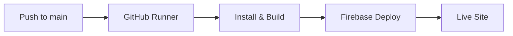

# SmartED CI/CD & Deployment Guide

> Automated deployment manual for the SmartED platform using GitHub Actions and Firebase Hosting.

[](https://smart-ed-b7023.web.app)
[](https://vitejs.dev/)
[](https://nodejs.org/)
[](LICENSE)

---

### Quick Reference

| Item | Value |
| :--- | :--- |
| **Repository** | [ShelumHansana/SmartED](https://github.com/ShelumHansana/SmartED) |
| **Firebase Project** | `smart-ed-b7023` |
| **Live URL** | [https://smart-ed-b7023.web.app](https://smart-ed-b7023.web.app) |
| **Hosting Target** | `frontend/dist` |
| **Workflow Path** | `.github/workflows/firebase-hosting-merge.yml` |

---

### Deployment Pipeline



| Channel | Trigger | Workflow File | Target URL |
| :--- | :--- | :--- | :--- |
| **Production** | Push to `main` | `firebase-hosting-merge.yml` | [smart-ed-b7023.web.app](https://smart-ed-b7023.web.app) |
| **Preview** | Pull Request to `main` | `firebase-hosting-pull-request.yml` | Temporary PR preview URL |

---

### Setup Instructions

#### 1. Generate Service Account Key (Google Cloud)
1. Open [Google Cloud IAM Service Accounts](https://console.cloud.google.com/iam-admin/serviceaccounts?project=smart-ed-b7023).
2. Click **Create Service Account** &rarr; Name: `github-actions-smart-ed`.
3. Assign roles:
   - **Firebase Hosting Admin**
   - **Service Account User**
4. Click **Done**, select the account, and go to the **Keys** tab.
5. Click **Add Key** &rarr; **Create new key** &rarr; select **JSON** &rarr; download the file.

> [!NOTE]
> Store this JSON key file securely. Never commit it to git or public repositories.

#### 2. Configure GitHub Repository Secret
1. Open [Repository Actions Secrets](https://github.com/ShelumHansana/SmartED/settings/secrets/actions).
2. Click **New repository secret**.
3. Set **Name:** `FIREBASE_SERVICE_ACCOUNT_SMART_ED_B7023`
4. Set **Value:** Paste the entire contents of the downloaded JSON file.
5. Click **Add secret**.

#### 3. Verify Workflows
The project includes two pre-configured workflows under `.github/workflows/`:
- `firebase-hosting-merge.yml` &mdash; builds and deploys to production on merge.
- `firebase-hosting-pull-request.yml` &mdash; builds and deploys preview channels on pull requests.

#### 4. Test Automated Deployment
```bash
git add .
git commit -m "chore: test deployment"
git push origin main
```
Track live progress under the repository's [Actions Tab](https://github.com/ShelumHansana/SmartED/actions).

---

### Manual Deployment (Fallback)

```bash
# 1. Build frontend
cd frontend
npm ci
npm run build
cd ..

# 2. Deploy hosting
firebase deploy --only hosting
```

---

### Troubleshooting Matrix

| Issue | Cause | Solution |
| :--- | :--- | :--- |
| `HTTP 403 / Permission Denied` | Missing IAM role | In Google Cloud IAM, grant `Firebase Hosting Admin` to the service account. |
| `Invalid Key / JSON Parse Error` | Incomplete secret payload | Copy the entire JSON file from `{` to `}` into the secret value. |
| `Project Not Found` | Project ID mismatch | Verify `projectId: smart-ed-b7023` in `.firebaserc` and workflow YAML. |
| `npm ci failure` | Out-of-sync lockfile | Run `npm install` locally in `frontend/` and commit updated `package-lock.json`. |
| `404 on page refresh` | Missing SPA rewrite | Confirm `"rewrites": [{"source": "**", "destination": "/index.html"}]` in `firebase.json`. |

---

### Maintenance & Security

- **Rollbacks:** Instant rollbacks can be performed directly from the [Firebase Hosting Console](https://console.firebase.google.com/project/smart-ed-b7023/hosting/sites/smart-ed-b7023).
- **Key Rotation:** Rotate Google Cloud keys every 90 days and update the corresponding GitHub secret.
