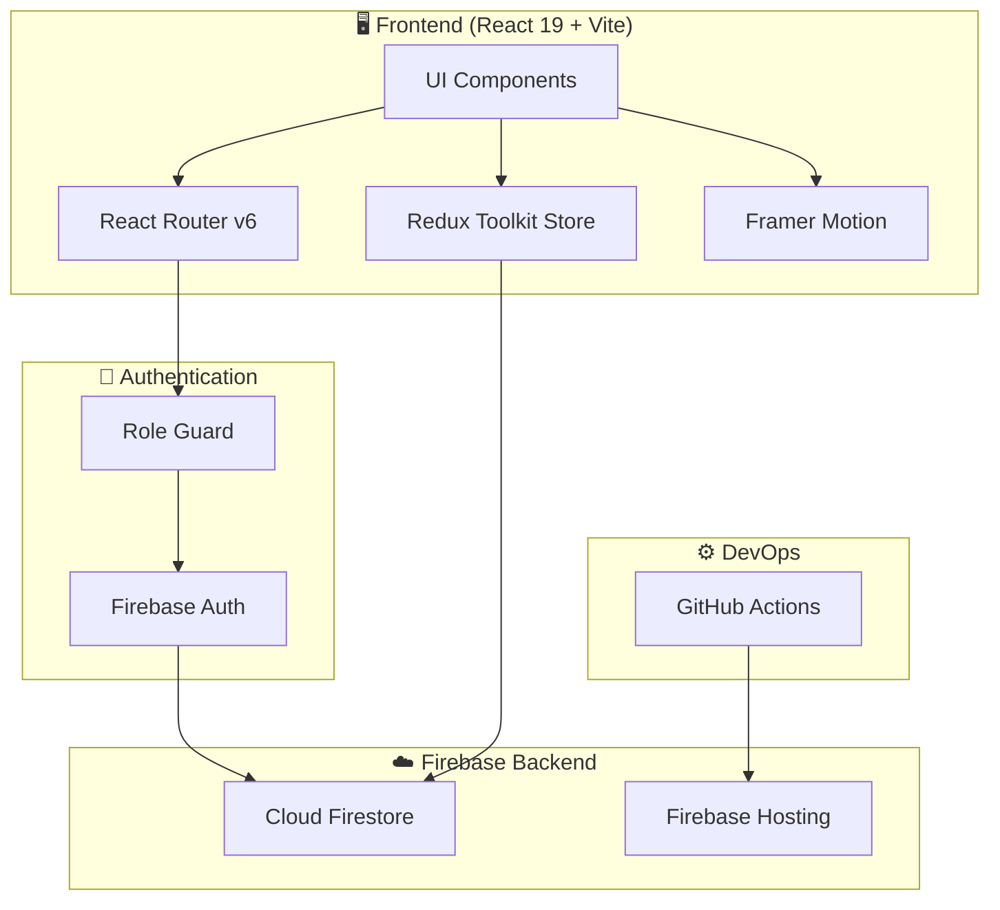

<div align="center">


<br/>

[](LICENSE)
[](https://react.dev/)
[](https://firebase.google.com/)
[](https://vitejs.dev/)
[](https://smart-ed-b7023.web.app)
[](.github/workflows)

<br/>

**A comprehensive, role-based school management platform built with modern web technologies.**
**Empowering administrators, teachers, students, and parents with real-time data & analytics.**

[🌐 Live Demo](https://smart-ed-b7023.web.app) · [📖 Documentation](#-documentation) · [🐛 Report Bug](https://github.com/ShelumHansana/SmartED/issues/new?template=bug_report.md) · [✨ Request Feature](https://github.com/ShelumHansana/SmartED/issues/new?template=feature_request.md)

</div>

---

## 📋 Table of Contents

- [Overview](#-overview)
- [Features](#-features)
- [Tech Stack](#-tech-stack)
- [Architecture](#-architecture)
- [Screenshots](#-screenshots)
- [Getting Started](#-getting-started)
- [Environment Variables](#-environment-variables)
- [Project Structure](#-project-structure)
- [Documentation](#-documentation)
- [Roadmap](#-roadmap)
- [Contributing](#-contributing)
- [License](#-license)
- [Acknowledgments](#-acknowledgments)

---

## 🔍 Overview

**SmartED** is a full-stack school management system designed specifically for the Sri Lankan education context. It provides a unified platform where different stakeholders — administrators, teachers, students, and parents — can interact through role-specific dashboards with real-time data synchronization.

### 🎯 Problem Statement

Traditional school management relies on paper-based systems and fragmented digital tools, leading to:
- Inefficient grade tracking and reporting
- Poor communication between teachers and parents
- Limited visibility into student progress
- Manual, error-prone administrative processes

### 💡 Solution

SmartED digitizes the entire school management workflow with:
- **Role-based access control** ensuring data security and relevant interfaces
- **Real-time analytics** for data-driven decisions
- **Automated CI/CD pipeline** for seamless deployments
- **Responsive design** that works across all devices

---

## ✨ Features

<div align="center">

| 🔐 **Admin Dashboard** | 👨‍🏫 **Teacher Dashboard** |
|---|---|
| User & role management | Grade entry & analytics |
| Course configuration | Student performance tracking |
| System-wide reporting | Assignment management |
| Settings & customization | Message board & communication |

| 🎒 **Student Dashboard** | 👨‍👩‍👧 **Parent Dashboard** |
|---|---|
| Academic progress overview | Multi-child monitoring |
| Assignment tracking | Grade & performance viewing |
| Exam marks & analytics | Teacher communication |
| Calculator & notes tools | Academic progress reports |

</div>

### Key Highlights

- 🏫 **4 Role-Based Dashboards** — Tailored experiences for Admin, Teacher, Student & Parent
- 📊 **Interactive Analytics** — Grade analytics with Chart.js & Recharts visualizations
- 🔐 **Secure Authentication** — Firebase Auth with protected routes and role validation
- 📱 **Fully Responsive** — Optimized for desktop, tablet, and mobile
- ✨ **Smooth Animations** — Powered by Framer Motion for professional UX
- 🚀 **Automated Deployment** — CI/CD via GitHub Actions to Firebase Hosting
- 🔥 **Real-time Sync** — Firebase Firestore for live data updates
- 🇱🇰 **Localized** — Designed for the Sri Lankan education system

---

## 🛠️ Tech Stack

<div align="center">

| Layer | Technology | Purpose |
|---|---|---|
| **Frontend** |  | UI components & rendering |
| **Build Tool** |  | Fast development & bundling |
| **State Management** |  | Global state management |
| **Routing** |  | Client-side routing |
| **Animation** |  | Page transitions & UI animations |
| **Charts** |  | Data visualization |
| **Authentication** |  | User login & role management |
| **Database** |  | NoSQL real-time database |
| **Hosting** |  | Production deployment |
| **CI/CD** |  | Automated testing & deployment |

</div>

---

## 🏗️ Architecture



---

## 📸 Screenshots

> **📌 Coming Soon** — Screenshots of each dashboard will be added here.
> 
> If you'd like to see the app in action, check out the [Live Demo](https://smart-ed-b7023.web.app).

<!--
Uncomment and add your screenshots:

<div align="center">


</div>
-->

---

## 🚀 Getting Started

### Prerequisites

- **Node.js** v18+ and **npm** v9+
- A **Firebase** project with Firestore and Authentication enabled
- **Git** installed

### Installation

```bash
# 1. Clone the repository
git clone https://github.com/ShelumHansana/SmartED.git
cd SmartED

# 2. Install dependencies
npm install

# 3. Set up environment variables (see below)
cp .env.example .env

# 4. Start the development server
npm run dev
```

The app will be available at `http://localhost:5173`

---

## 🔑 Environment Variables

Create a `.env` file in the root directory with your Firebase configuration:

```env
VITE_FIREBASE_API_KEY=your_api_key
VITE_FIREBASE_AUTH_DOMAIN=your_auth_domain
VITE_FIREBASE_PROJECT_ID=your_project_id
VITE_FIREBASE_STORAGE_BUCKET=your_storage_bucket
VITE_FIREBASE_MESSAGING_SENDER_ID=your_sender_id
VITE_FIREBASE_APP_ID=your_app_id
```

> **Note:** Never commit your `.env` file. It's already included in `.gitignore`.

---

## 📁 Project Structure

```
SmartED/
├── .github/
│   └── workflows/         # CI/CD pipeline configurations
├── public/                # Static assets
├── src/
│   ├── assets/            # Images, icons, fonts
│   ├── components/        # Reusable UI components
│   │   ├── common/        # Shared components (buttons, cards, etc.)
│   │   ├── admin/         # Admin-specific components
│   │   ├── teacher/       # Teacher-specific components
│   │   ├── student/       # Student-specific components
│   │   └── parent/        # Parent-specific components
│   ├── pages/             # Page-level components
│   ├── store/             # Redux Toolkit slices & store
│   ├── services/          # Firebase service functions
│   ├── hooks/             # Custom React hooks
│   ├── utils/             # Utility functions & constants
│   ├── routes/            # Route configurations & guards
│   ├── App.jsx            # Main application component
│   └── main.jsx           # Entry point
├── .env.example           # Environment template
├── firebase.json          # Firebase configuration
├── vite.config.js         # Vite configuration
└── package.json           # Dependencies & scripts
```

---

## 📖 Documentation

| Resource | Link |
|---|---|
| 🌐 Live Application | [smart-ed-b7023.web.app](https://smart-ed-b7023.web.app) |
| 🐛 Bug Reports | [GitHub Issues](https://github.com/ShelumHansana/SmartED/issues) |
| ✨ Feature Requests | [GitHub Issues](https://github.com/ShelumHansana/SmartED/issues) |

---

## 🗺️ Roadmap

- [x] Role-based authentication system
- [x] Admin dashboard with user management
- [x] Teacher grade entry & analytics
- [x] Student academic progress view
- [x] Parent monitoring portal
- [x] CI/CD pipeline with GitHub Actions
- [ ] Push notifications for parents
- [ ] Multi-language support (Sinhala, Tamil, English)
- [ ] Offline mode with service workers
- [ ] Mobile app version (React Native)
- [ ] Advanced analytics & reporting

---

## 🤝 Contributing

Contributions are welcome! Here's how you can help:

1. **Fork** the repository
2. **Create** a feature branch (`git checkout -b feature/amazing-feature`)
3. **Commit** your changes (`git commit -m 'feat: add amazing feature'`)
4. **Push** to the branch (`git push origin feature/amazing-feature`)
5. **Open** a Pull Request

Please ensure your code follows the existing style and all tests pass.

---

## 📄 License

This project is licensed under the **MIT License** — see the [LICENSE](LICENSE) file for details.

---

## 🙏 Acknowledgments

- [React](https://react.dev/) — UI library
- [Firebase](https://firebase.google.com/) — Backend-as-a-Service
- [Vite](https://vitejs.dev/) — Build tool
- [Framer Motion](https://www.framer.com/motion/) — Animations
- [Chart.js](https://www.chartjs.org/) & [Recharts](https://recharts.org/) — Data visualization
- [Redux Toolkit](https://redux-toolkit.js.org/) — State management

---

<div align="center">

**Built with ❤️ by [Shelum Hansana](https://github.com/ShelumHansana)**


</div>
