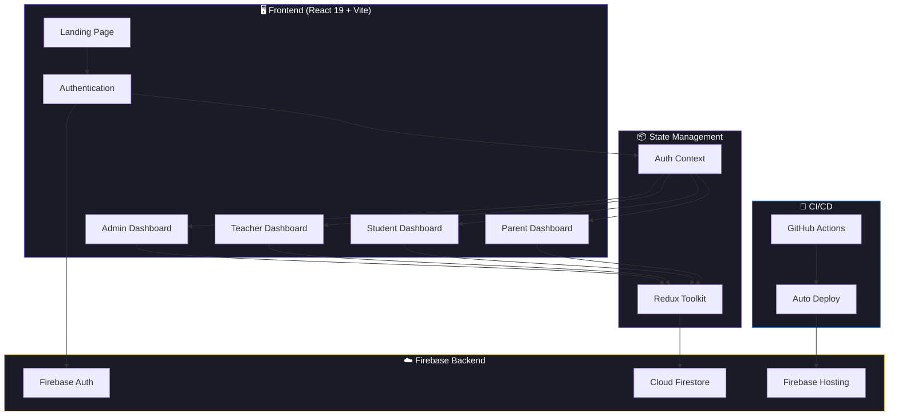

<div align="center">


<br/>

[](LICENSE)
[](https://react.dev/)
[](https://firebase.google.com/)
[](https://vitejs.dev/)
[](https://smart-ed-b7023.web.app)
[](.github/workflows)

<br/>

**A comprehensive, role-based school management platform built with modern web technologies.**
**Empowering administrators, teachers, students, and parents with real-time data & analytics.**

[🌐 Live Demo](https://smart-ed-b7023.web.app) · [📖 Documentation](#-documentation) · [🐛 Report Bug](https://github.com/ShelumHansana/SmartED/issues/new?template=bug_report.md) · [✨ Request Feature](https://github.com/ShelumHansana/SmartED/issues/new?template=feature_request.md)

</div>

---

## 📋 Table of Contents

- [Overview](#-overview)
- [Features](#-features)
- [Tech Stack](#-tech-stack)
- [Architecture](#-architecture)
- [Getting Started](#-getting-started)
- [Project Structure](#-project-structure)
- [Documentation](#-documentation)
- [Roadmap](#-roadmap)
- [Contributing](#-contributing)
- [License](#-license)
- [Acknowledgments](#-acknowledgments)

---

## 🔍 Overview

**SmartED** is a full-stack school management system designed specifically for the Sri Lankan education context. It provides a unified platform where different stakeholders — administrators, teachers, students, and parents — can interact through role-specific dashboards with real-time data synchronization.

### 🎯 Problem Statement

Traditional school management relies on paper-based systems and fragmented digital tools, leading to:
- Inefficient grade tracking and reporting
- Poor communication between teachers and parents
- Limited visibility into student progress
- Manual, error-prone administrative processes

### 💡 Solution

SmartED digitizes the entire school management workflow with:
- **Role-based access control** ensuring data security and relevant interfaces
- **Real-time analytics** for data-driven decisions
- **Automated CI/CD pipeline** for seamless deployments
- **Responsive design** that works across all devices

---

## ✨ Features

<div align="center">

| 🔐 **Admin Dashboard** | 👨‍🏫 **Teacher Dashboard** |
|---|---|
| User & role management | Grade entry & analytics |
| Course configuration | Student performance tracking |
| System-wide reporting | Assignment management |
| Settings & customization | Message board & communication |

| 🎒 **Student Dashboard** | 👨‍👩‍👧 **Parent Dashboard** |
|---|---|
| Academic progress overview | Multi-child monitoring |
| Assignment tracking | Grade & performance viewing |
| Exam marks & analytics | Teacher communication |
| Calculator & notes tools | Academic progress reports |

</div>

### Key Highlights

- 🏫 **4 Role-Based Dashboards** — Tailored experiences for Admin, Teacher, Student & Parent
- 📊 **Interactive Analytics** — Grade analytics with Chart.js & Recharts visualizations
- 🔐 **Secure Authentication** — Firebase Auth with protected routes and role validation
- 📱 **Fully Responsive** — Optimized for desktop, tablet, and mobile
- ✨ **Smooth Animations** — Powered by Framer Motion for professional UX
- 🚀 **Automated Deployment** — CI/CD via GitHub Actions to Firebase Hosting
- 🔥 **Real-time Sync** — Firebase Firestore for live data updates
- 🇱🇰 **Localized** — Designed for the Sri Lankan education system

---

## 🛠️ Tech Stack

<div align="center">

| Layer | Technology | Purpose |
|---|---|---|
| **Frontend** |  | UI components & rendering |
| **Build Tool** |  | Fast development & bundling |
| **State Management** |  | Global state management |
| **Routing** |  | Client-side navigation |
| **Animation** |  | UI animations & transitions |
| **Charts** |   | Data visualization |
| **Backend** |  | Auth, Firestore, Hosting |
| **CI/CD** |  | Automated testing & deployment |
| **Linting** |  | Code quality enforcement |

</div>

---

## 🏗️ Architecture



---

## 🚀 Getting Started

### Prerequisites

- **Node.js** ≥ 18.0.0
- **npm** ≥ 9.0.0
- **Firebase CLI** (for deployment)

### Installation

1. **Clone the repository**
   ```bash
   git clone https://github.com/ShelumHansana/SmartED.git
   cd SmartED
   ```

2. **Install frontend dependencies**
   ```bash
   cd frontend
   npm install
   ```

3. **Install backend dependencies**
   ```bash
   cd ../backend
   npm install
   ```

4. **Configure Firebase**
   
   Create a Firebase project at [Firebase Console](https://console.firebase.google.com/) and update `frontend/src/utils/firebase.js` with your configuration:
   ```javascript
   const firebaseConfig = {
     apiKey: "YOUR_API_KEY",
     authDomain: "YOUR_AUTH_DOMAIN",
     projectId: "YOUR_PROJECT_ID",
     storageBucket: "YOUR_STORAGE_BUCKET",
     messagingSenderId: "YOUR_MESSAGING_SENDER_ID",
     appId: "YOUR_APP_ID"
   };
   ```

5. **Start the development server**
   ```bash
   cd ../frontend
   npm run dev
   ```

6. **Open your browser**
   ```
   http://localhost:5173
   ```

### Firebase Deployment

```bash
# Build the frontend
cd frontend
npm run build

# Deploy to Firebase Hosting
cd ..
firebase deploy --only hosting
```

> 💡 **Tip:** Push to the `main` branch triggers automatic deployment via GitHub Actions!

---

## 📁 Project Structure

```
SmartED/
├── 📂 .github/
│   └── workflows/              # CI/CD pipeline configuration
│       ├── firebase-hosting-merge.yml
│       └── firebase-hosting-pull-request.yml
├── 📂 backend/
│   ├── firebase/config.js      # Firebase configuration
│   ├── index.js                # Backend entry point
│   ├── scripts/                # Database initialization scripts
│   ├── services/               # Business logic layer
│   │   ├── adminService.js     # Admin operations
│   │   ├── authService.js      # Authentication logic
│   │   ├── dbInitService.js    # Database setup
│   │   └── userService.js      # User management
│   └── utils/                  # Shared utilities
├── 📂 frontend/
│   ├── public/                 # Static assets
│   ├── src/
│   │   ├── components/         # React components
│   │   │   ├── dashboard/      # Student dashboard modules
│   │   │   └── teacher/        # Teacher-specific components
│   │   ├── contexts/           # React Context providers
│   │   ├── data/               # Static data & constants
│   │   ├── hooks/              # Custom React hooks
│   │   ├── services/           # API service layer
│   │   ├── styles/             # CSS stylesheets
│   │   │   └── teacher/        # Teacher-specific styles
│   │   └── utils/              # Frontend utilities
│   ├── index.html              # App entry point
│   ├── vite.config.js          # Vite configuration
│   └── package.json            # Frontend dependencies
├── firebase.json               # Firebase hosting config
├── CONTRIBUTING.md             # Contribution guidelines
├── CODE_OF_CONDUCT.md          # Community guidelines
├── SECURITY.md                 # Security policy
├── LICENSE                     # MIT License
└── README.md                   # This file
```

---

## 📖 Documentation

| Document | Description |
|---|---|
| [DEPLOYMENT_GUIDE.md](DEPLOYMENT_GUIDE.md) | Step-by-step deployment instructions |
| [CONTRIBUTING.md](CONTRIBUTING.md) | How to contribute to SmartED |
| [CODE_OF_CONDUCT.md](CODE_OF_CONDUCT.md) | Community behavior guidelines |
| [SECURITY.md](SECURITY.md) | Security vulnerability reporting |

---

## 🗺️ Roadmap

- [x] Multi-role authentication system
- [x] Admin dashboard with user management
- [x] Teacher grade entry & analytics
- [x] Student progress dashboard
- [x] Parent monitoring portal
- [x] Firebase CI/CD pipeline
- [ ] Mobile-responsive optimization
- [ ] Push notifications
- [ ] Attendance tracking module
- [ ] Timetable management
- [ ] Report card generation (PDF)
- [ ] Multi-language support (Sinhala/Tamil/English)
- [ ] PWA support for offline access
- [ ] API documentation with Swagger

---

## 🤝 Contributing

Contributions are what make the open-source community such an amazing place to learn, inspire, and create. Any contributions you make are **greatly appreciated**.

Please read [CONTRIBUTING.md](CONTRIBUTING.md) for details on our code of conduct and the process for submitting pull requests.

1. Fork the Project
2. Create your Feature Branch (`git checkout -b feature/AmazingFeature`)
3. Commit your Changes (`git commit -m 'feat: add some AmazingFeature'`)
4. Push to the Branch (`git push origin feature/AmazingFeature`)
5. Open a Pull Request

---

## 📄 License

Distributed under the **MIT License**. See [LICENSE](LICENSE) for more information.

---

## 🙏 Acknowledgments

- [React](https://react.dev/) — UI library
- [Firebase](https://firebase.google.com/) — Backend services
- [Vite](https://vitejs.dev/) — Build tool
- [Chart.js](https://www.chartjs.org/) & [Recharts](https://recharts.org/) — Data visualization
- [Framer Motion](https://www.framer.com/motion/) — Animations
- [Shields.io](https://shields.io/) — Badges

---

<div align="center">

**Built with ❤️ by [Shelum Hansana](https://github.com/ShelumHansana)**

⭐ Star this repo if you find it helpful!


</div>
