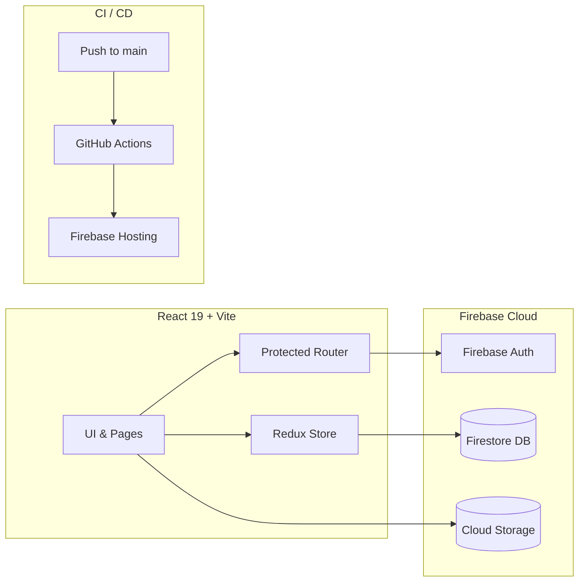

# SmartED

> **A modern, role-based school management platform built with React 19, Vite, and Firebase.**  
> Empowering administrators, teachers, students, and parents with real-time academic analytics and collaboration.

[](https://smart-ed-b7023.web.app)
[](https://react.dev/)
[](https://vitejs.dev/)
[](https://firebase.google.com/)
[](LICENSE)

[Live Demo](https://smart-ed-b7023.web.app) &bull; [Deployment Guide](DEPLOYMENT_GUIDE.md) &bull; [Contributing](CONTRIBUTING.md) &bull; [Security](SECURITY.md) &bull; [Report Bug](https://github.com/ShelumHansana/SmartED/issues/new?template=bug_report.md)

---

### Overview

SmartED is a unified educational management platform designed to streamline administrative workflows, simplify grade calculation and reporting, and connect teachers, parents, and students through dedicated, role-specific portals.

#### Core Role Dashboards

| Role | Primary Responsibilities & Tools |
| :--- | :--- |
| **Admin** | User provisioning, class allocation, role permissions, and system settings. |
| **Teacher** | Term grade and marks entry, student performance charts, and announcements. |
| **Student** | Subject progress tracking, mark sheets, assignment submissions, and GPA view. |
| **Parent** | Multi-child academic monitoring, progress cards, and teacher correspondence. |

---

### Architecture



---

### Tech Stack

| Component | Technology | Purpose |
| :--- | :--- | :--- |
| **Frontend** | React 19, Vite | Single-page application rendering and fast HMR |
| **State Management** | Redux Toolkit | Centralized user state and dashboard caching |
| **Routing** | React Router v6 | Client-side routing with authenticated role guards |
| **Charts & UX** | Chart.js, Recharts, Framer Motion | Academic analytics curves and micro-animations |
| **Backend / DB** | Firebase Auth, Cloud Firestore | Authentication and real-time NoSQL database |
| **Cloud Hosting** | Firebase Hosting, GitHub Actions | Zero-downtime CI/CD deployment |

---

### Getting Started

#### Prerequisites
- Node.js `18.0.0` or higher
- npm `9.0.0` or higher
- A Firebase project with Firestore, Authentication, and Hosting enabled

#### Quick Setup

```bash
# 1. Clone the repository
git clone https://github.com/ShelumHansana/SmartED.git
cd SmartED

# 2. Install dependencies
cd frontend
npm install
cp .env.example .env

# 3. Start local development server
npm run dev
```

The application will be accessible at `http://localhost:5173`.

#### Backend Setup (Optional Services)
```bash
cd ../backend
npm install
```

---

### Environment Variables

Configure `frontend/.env` with your Firebase credentials:

```env
VITE_FIREBASE_API_KEY=your_api_key
VITE_FIREBASE_AUTH_DOMAIN=smart-ed-b7023.firebaseapp.com
VITE_FIREBASE_DATABASE_URL=https://smart-ed-b7023-default-rtdb.asia-southeast1.firebasedatabase.app
VITE_FIREBASE_PROJECT_ID=smart-ed-b7023
VITE_FIREBASE_STORAGE_BUCKET=smart-ed-b7023.firebasestorage.app
VITE_FIREBASE_MESSAGING_SENDER_ID=54852021153
VITE_FIREBASE_APP_ID=1:54852021153:web:b6f4386df82ae42875b9e0
```

---

### Project Structure

```
SmartED/
├── .github/              # GitHub Actions workflows and issue templates
├── backend/              # Node.js backend services, seeds, and Firebase admin
├── frontend/             # React 19 Vite application
│   ├── src/
│   │   ├── components/   # Modular UI & dashboard components by role
│   │   ├── pages/        # Route page views
│   │   ├── store/        # Redux Toolkit store & slices
│   │   ├── styles/       # Design system and responsive styles
│   │   └── utils/        # Firebase client setup & helper utilities
│   ├── index.html        # HTML entry point
│   └── vite.config.js    # Bundler config
├── DEPLOYMENT_GUIDE.md   # Production deployment and CI/CD manual
├── CONTRIBUTING.md       # Contribution guidelines & commit convention
├── SECURITY.md           # Security disclosure policy
└── firebase.json         # Firebase Hosting routing and rewrites
```

---

### Documentation & Reference

- [Deployment Guide](DEPLOYMENT_GUIDE.md) &mdash; Continuous deployment with GitHub Actions
- [Contributing Guidelines](CONTRIBUTING.md) &mdash; Branching strategy, commit format, and style guide
- [Security Policy](SECURITY.md) &mdash; Responsible disclosure and security practices
- [Code of Conduct](CODE_OF_CONDUCT.md) &mdash; Community participation standards

---

### License

Distributed under the **MIT License**. See [LICENSE](LICENSE) for details.

Developed with care for educational communities by [Shelum Hansana](https://github.com/ShelumHansana).
